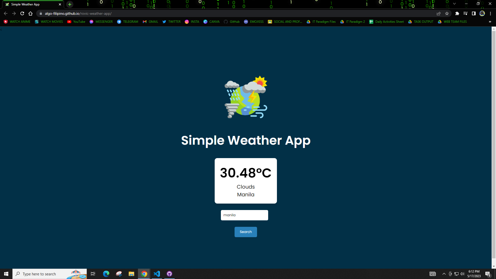

# Weather App using Open Weather API

> This is a simple weather app that was developed using HTML, CSS, JavaScript, and OpenWeather API.
> 
> Website Link: *[https://rovicbalingbing.github.io/weather-app/](https://rovicbalingbing.github.io/weather-app/)*

 
